## MachineLearningRealEstatePredictions

  

“**Group 2: Jean Paul, Cory, Manitha, Joe**”
* **Jean Paul**:  ntorenduwayo
* **Cory**:	corypeacock
* **Manitha**:  manithamanoj
* **Joe**:  josephawanis30

[SLIDESHOW](ML_Real_Estate_Prediction_Slideshow.pdf)

## Overview
According to the May 6, 2022, Cromford Report,[^1] the housing market in Central Phoenix is just beginning to pick up again after a very slow year for Real Estate sales. Despite the slow year, the median sale price currently sits at $425,000, up 27.6% from May 5, 2021, with a monthly volume of 9,500 sales. This very active market warrants investigation.  

There are, of course, numerous features that factor into the listing price for any realty listing. On one end of the spectrum, large data-driven companies like Zillow are able to utilize their algorithms to price homes very accurately. According to Zillow’s website,[^2] their nationwide median error rate for an on-market home “Zestimate” is 1.9%. On the other end of the spectrum, independent realtors utilize a mix of experiential intuition and “comps” - hyper local comparable house listings. According to Brian Houle, a local Phoenix Realtor, finding six to ten homes within a two-mile radius with a similar square footage and similar housing condition / quality is a good starting place for finding accurate pricing. What independent Realtors have internalized as intuition, data-driven Realtors have made explicit in their algorithms, the features of which are typically not publicly available.  

The primary purpose of this analysis is to create a machine learning model that can predict housing prices for single-family detached homes in the central Phoenix area utilizing features that are publicly available.  

## Data Sourcing
The preliminary data set was sourced from the FlexMLS Realty portal available to Real Estate Agents and their clients. The search for data points was conducted on May 6 and 7, 2022. All houses currently for sale as of May 6th, or sold within the 14 days prior to May 7, within a radius of 10 miles from Indian Steel Park in Central Phoenix, with an asking price of $1,300,000 or less were included in the search. The search resulted in more than 2,300 houses for sale or recently sold. Given that the average sale price percentage compared to listed sale price is 101.83%,[^3] there is little need to differentiate between houses listed for sale and those sold.

The features of each data point include:
* ID
* Price (Asking Price / Sale Price)
* Address
* Zip
* Status (Active, Under Contract, etc.)
* Subdivision
* Year built
* Bedrooms
* Bathrooms
* Approximate Square Footage

Additional data was retrieved from the Arizona Department of Education,[^4] in order to provide an education score for each house listed in the dataset above. For each zip code in the dataset, the best scoring elementary school in the zip code’s school district was attached. The presupposition of this choice is that homebuyers in Arizona, having the option of school choice, will be influenced positively or negatively by the best school in the general proximity of the house under consideration.  

For each zip code, a crime score was also added by retrieving data from the crime statistics open data section of Phoenix.gov.[^5] Individual crime reports were grouped by zip code and the sum of crimes by zip code was divided by all crime reports in the dataset in order to give a crime score for each zip code. Where a zip code was not represented in the city of Phoenix crime dataset, due to the jurisdiction of another city, the median crime score was used.

## Exploratory Data Analysis

Please see the EDA.ipynb file in the Exploratory_Data_Analysis folder of this repository.  

Early exploratory analysis of the data included graphs of descriptive statistics, including:  

### Density plot - price
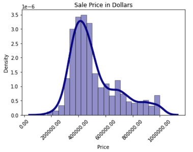  

### Quartile / Mean / Mode table - price
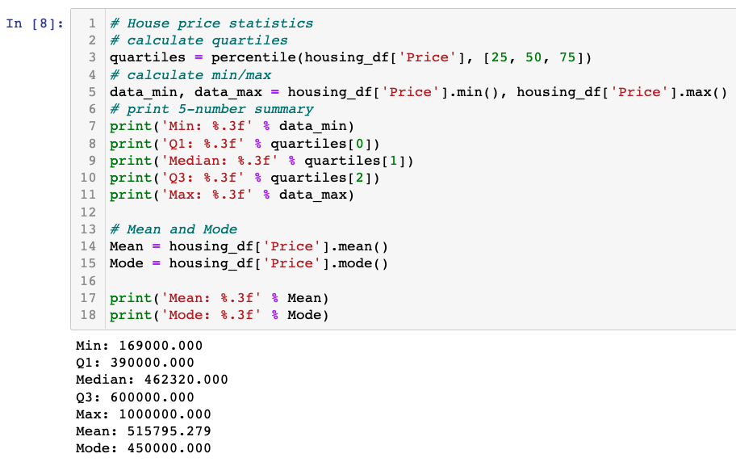  

### Correlation matrix
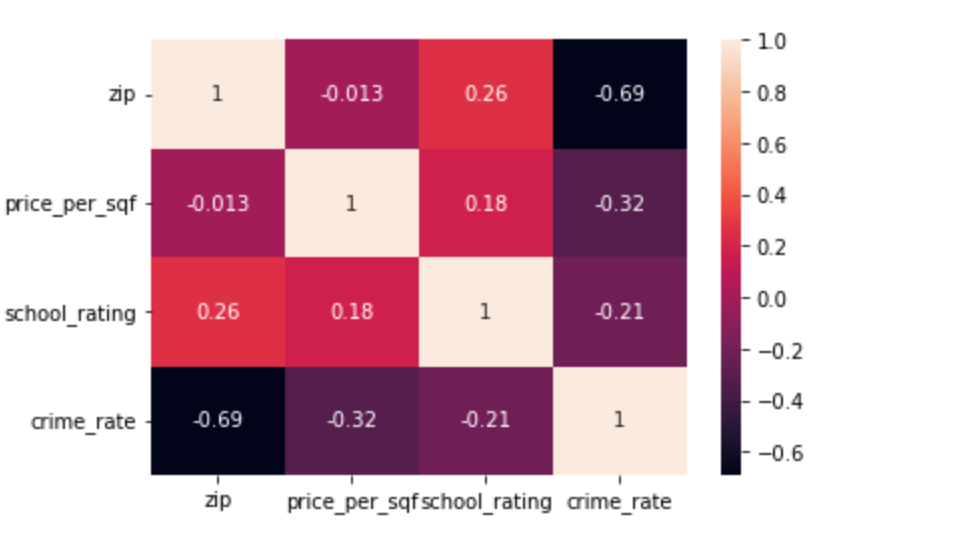  

### Density plot - sqft
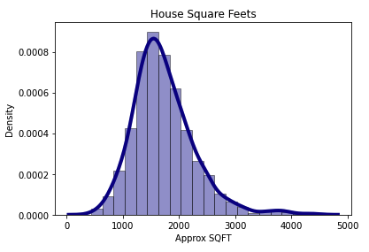  

### Quartile / Mean / Mode table - sqft
  

### Density plot - bedrooms
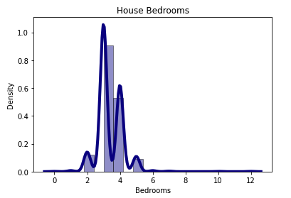  

### Quartile / Mean / Mode table - bedrooms
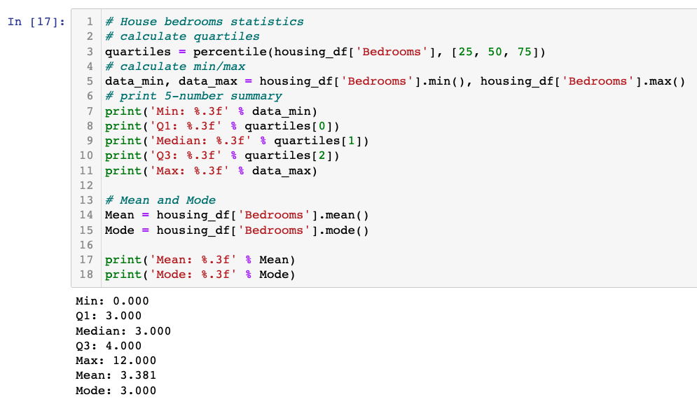  

### Density plot - bathrooms
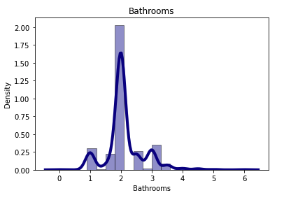  

### Quartile / Mean / Mode table - bathrooms
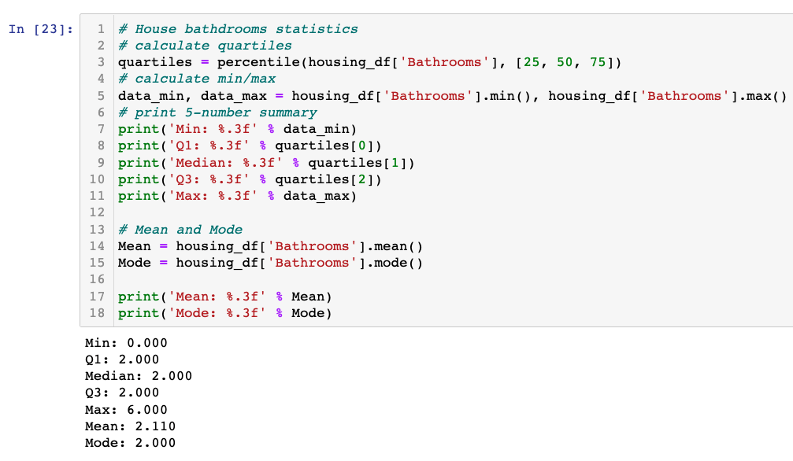  

## Model Exploration
Early attempts at models included a multiple linear regressor and a neural network. Due to the particularities of the dataset, neither proved particularly useful models on first pass. The results were weak enough that the originally suggested model of a Random Forest Regressor was chosen as the correct model for the project.  

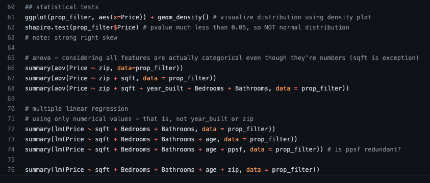  
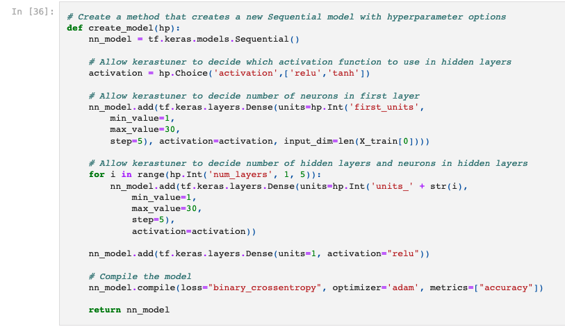  

## Process
This analysis will use a Jupyter Notebook, using Python 3.7.11, as the primary method for processing and analyzing the datasets for this project.

The primary file is: RandomForestRegressor.ipynb. An outline of the work flow is as follows:  
1. Import Dependencies
1. Import Data
   1. Combined data
   1. Education data
   1. Crime data
1. Data Cleaning
   1. Renaming columns
   1. Dropping columns
   1. Combining tables via joins
1. Finding Best Parameters
   1. Using RandomizedSearchCV
1. Database - SQLite
   1. Send to SQLite DB
   1. Retrieve from SQLite DB
1. Random Forest Model Creation
   1. Split into train/test
   1. Fit & Evaluate
   1. Predictions
   1. Decision tree (from Best Model.ipynb)
1. Export necessary information for storyboard / dashboard

## Database
SQlite is the database we are planning to use. SQLite typically works well as the database engine for low to medium traffic websites (which is to say, 99.9% of all websites).  SQLite is an open source software, also SQLite a an appropriate database tool to power our dashboard. Generally speaking, any site that gets fewer than 100K hits/day should work fine with SQLite. The 100K hits/day figure is a conservative estimate, not a hard upper bound. SQLite has been demonstrated to work with 10 times that amount of traffic.  

For this project, SQLite will serve to hold our final combined dataset in order to provide the data for visualizations on the dashboard in conjunction with the primary purpose - a predicted home price.  

The Entity Relationship Diagram (ERD) for the database can be seen below.  

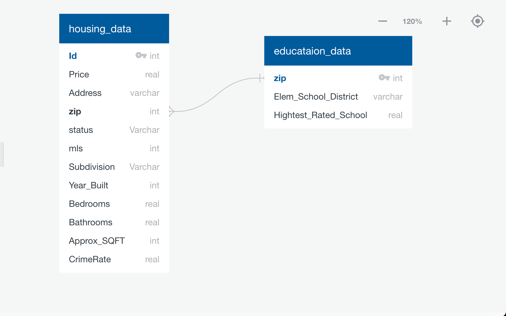  

In the later stage we added Postgres Database for heroku deployment.
## Machine Learning
We used a RandomForestRegressor algorithm (i.e., a supervised learning algorithm and an ensemble of a decision trees algorithm) for modeling:  
* It is supervised algorithm because during the model training, it learns the mappings between the input features (e.g., Number of bedrooms) and the outputs feature or target (House Price).  
* It is an assemble algorithm because it combines or assembles multiple decision trees into a final decision to make a more accurate prediction than any underlying algorithm could on its own.  

This model is one of the most popular algorithms for regression problems that is used to predict continuous outcomes due to its simplicity and high accuracy. This algorithm consists of two steps process, i.e., Building n decision tree regressors (estimators), and finding an average prediction across estimators.  

The regression using decision trees starts with the selection of attribute values to determine the best split, and once the best split is found, the dataset is split at that value (i.e., the root node) and the process is repeated for all the other ranges until a stopping condition (e.g., Maximum depth, or a minimum number of samples) is reached. Below is a graph depicting the actual house prices versus the prices predicted by the model.  

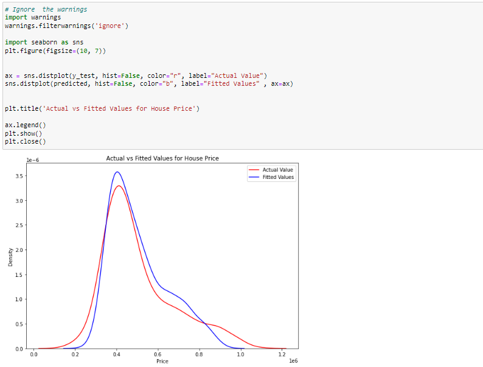  

## Results
Utilizing the RandomizedSearchCV module from sklearn.model_selection, we were able to determine that the best parameters for our model were:  

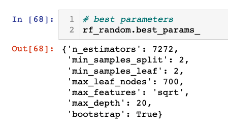. 

After the standard protocol for machine learning, including a train / test split of the dataset, we were able to achieve a testing score accuracy of 74.3%.  

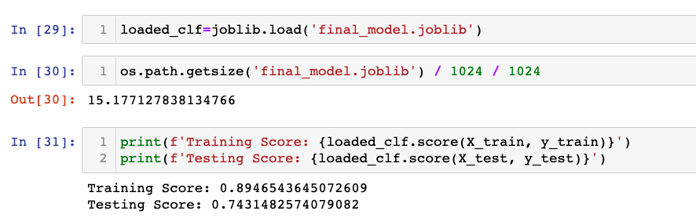
## Dasboard
We created a dashboard to use our model and display our findings. First we have created a  story board using figma web app. Then we have created  a design for the website using HTML. Next we have established a connection with our model that is the Home page using the flask app. We have  also established a connection with Postgres to display data using the flask app. We have used Tableau to create all three  interactive visualizations (average price per sqft per zip,  school ratings per zip, crime rate per zip) and embedded into the visualization page. We have also embedded a pdf which has the entire journey of this project in the About page.

## Summary
Given a dataset of approximately 2,300 houses and their associated metadata, crime statistics from Phoenix.gov, and education scores from the Arizona Department of Education, we were able to achieve 74.3% accuracy on predicting home sale prices. Given a larger dataset and more robust data for both crime and education, it is possible that this model would improve. Nevertheless, the model predicts home prices well given a minimum number of house and location features.  

---
Footnotes:  
[^1]: The Cromford Report, accessed 6 May 2022.  
[^2]: https://www.zillow.com/z/zestimate/ , accessed 19 May 2022.  
[^3]: The Cromford Report, accessed 6 May 2022.  
[^4]: https://azsbe.az.gov/f-school-letter-grades , accessed 7 May 2022.  
[^5]: https://www.phoenix.gov/police/resources-information/crime-stats-maps , accessed 14 May 2022.  
